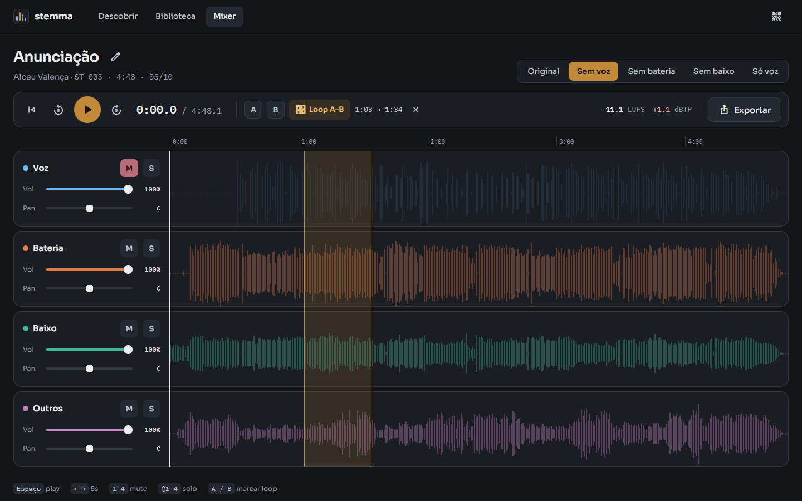
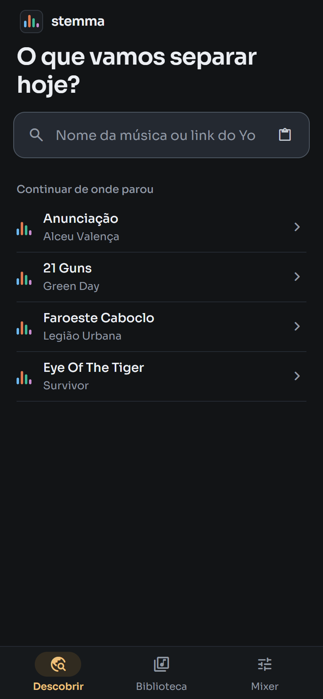
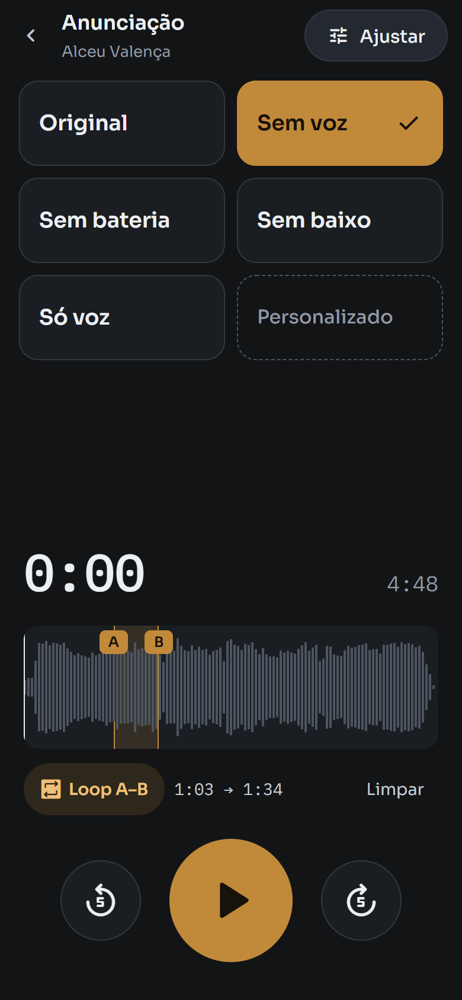
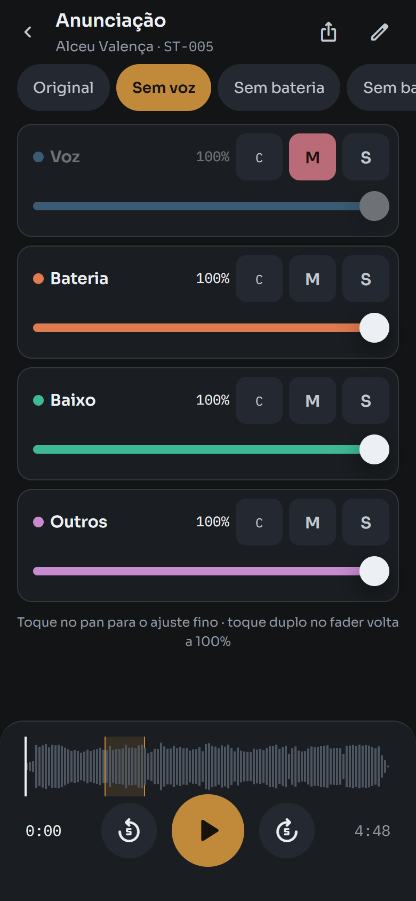

<a href="README.md">English</a> · <strong>Português</strong>

  

<h1 align="center">stemma</h1>

  <strong>Tire a voz. Isole o baixo. Toque junto.</strong> 
  Separe qualquer música em voz, bateria, baixo e outros com IA, no seu próprio PC, 
  e mixe cada parte do desktop ou do celular.

  
  
  
  

  <a href="https://github.com/Arthur-Luciani/stemma/releases/latest"><strong>Baixar para Windows</strong></a>
  ·
  <a href="#como-funciona">Como funciona</a>
  ·
  <a href="#instalar">Instalar</a>

  

## Para que serve

- 🎤 **Cantar por cima**: o preset **Sem voz** transforma qualquer música em karaokê.
- 🥁 **Tocar no lugar da banda**: tire a bateria, o baixo ou a guitarra e assuma a parte.
- 🎧 **Tirar de ouvido**: deixe só o baixo em **solo**, marque o trecho difícil e repita em **loop A–B** até sair.

## Como funciona

1. **Busque.** Digite o nome da música ou cole um link do YouTube.
2. **Separe.** O [Demucs](https://github.com/facebookresearch/demucs) roda na sua GPU e divide a música em 4 stems. Uma música de 5 minutos fica pronta em cerca de 1 minuto[^tempo].
3. **Toque junto.** Abra o mixer, escolha um preset ou ajuste cada stem e dê o play.

## No celular também

O Stemma roda no seu PC e abre no celular como app (PWA), com HTTPS, pelo [Tailscale](https://tailscale.com/). Não precisa abrir porta no roteador nem expor nada na internet. Para abrir, aponte a câmera para o QR code do app ou do ícone na bandeja do Windows.

  
  &nbsp;
  
  &nbsp;
  

## Recursos

| Recurso | O que faz |
|---|---|
| 🎚️ **Mixer por stem** | Volume, pan, mute e solo em voz, bateria, baixo e outros. |
| ⚡ **Presets de um toque** | Original, Sem voz, Sem bateria, Sem baixo e Só voz. |
| 🔁 **Loop A–B** | Repita o trecho que você está estudando, quantas vezes quiser. |
| 💾 **Exportar** | Baixe a sua mixagem em MP3 ou WAV. |
| 📚 **Biblioteca** | Busca, filtros, e o mix de cada música salvo do jeito que você deixou. |
| 📊 **Loudness** | LUFS e true peak de cada música. |
| ⌨️ **Atalhos** | No desktop: espaço toca, 1–4 silenciam, ⇧1–4 dão solo, A/B marcam o loop. |
| 🔄 **Atualiza sozinho** | Quando sai uma versão nova, o próprio app avisa e se atualiza, sem você ir até o PC. |

## Seu PC, suas músicas

Tudo roda localmente: o download, a separação e o mixer. Não tem conta, não tem assinatura e nenhum áudio vai para a nuvem. No celular, o acesso fica restrito aos seus dispositivos, dentro da sua rede Tailscale.

## Instalar

**Você precisa de:** Windows 11, placa de vídeo NVIDIA com driver instalado e uns 6 GB livres (mais ~50 MB por música). Sem GPU NVIDIA o Stemma funciona, mas a separação na CPU é bem mais lenta.

1. Baixe o `Stemma-Setup-vX.Y.Z.exe` da [última versão](https://github.com/Arthur-Luciani/stemma/releases/latest).
2. Abra. O instalador não tem assinatura de código, então o Windows avisa: clique em **Mais informações → Executar assim mesmo**.
3. Escolha onde guardar as músicas. Portas, HTTPS e Tailscale o instalador resolve sozinho e só pergunta quando precisa de você.
4. No fim, clique em **Abrir o Stemma** ou aponte o celular para o QR code.

Para atualizar, é só aceitar o aviso de versão nova no app ou rodar o instalador da versão nova. Se a atualização falhar, ele volta para a versão anterior com o banco intacto. Detalhes, rollback e logs estão em [docs/operacao.md](docs/operacao.md).

## Feito com

[Demucs](https://github.com/facebookresearch/demucs) (separação) · [yt-dlp](https://github.com/yt-dlp/yt-dlp) (download) · [FFmpeg](https://ffmpeg.org/) · [FastAPI](https://fastapi.tiangolo.com/) · [React](https://react.dev/) + [Vite](https://vite.dev/) · Web Audio API · [Tailscale](https://tailscale.com/)

## Uso responsável

O Stemma é feito para estudo e uso pessoal. Respeite os direitos autorais e os termos de uso dos serviços de onde vêm as músicas, e não redistribua stems de obras protegidas.

## Para desenvolvedores

Backend em FastAPI + SQLite, frontend em React + TypeScript, servidos juntos por um único processo que roda como serviço do Windows. Para rodar em dev, veja [docs/desenvolvimento.md](docs/desenvolvimento.md). Arquitetura, regras e comandos estão no [CLAUDE.md](CLAUDE.md), e as decisões de arquitetura em [docs/decisions](docs/decisions).

## Licença

[MIT](LICENSE) © Arthur Luciani

[^tempo]: Medido no PC de referência, com GPU NVIDIA, contando o download.
